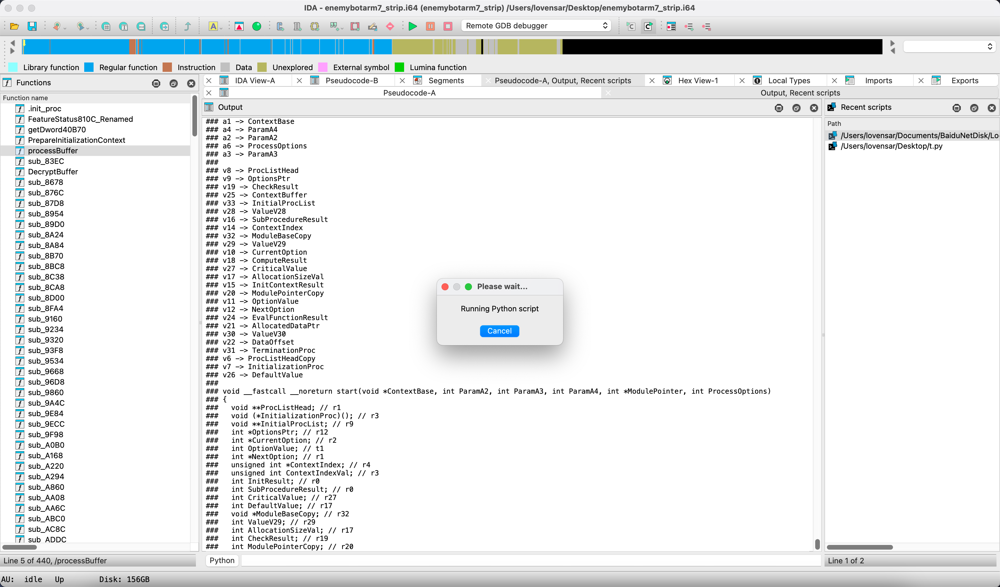
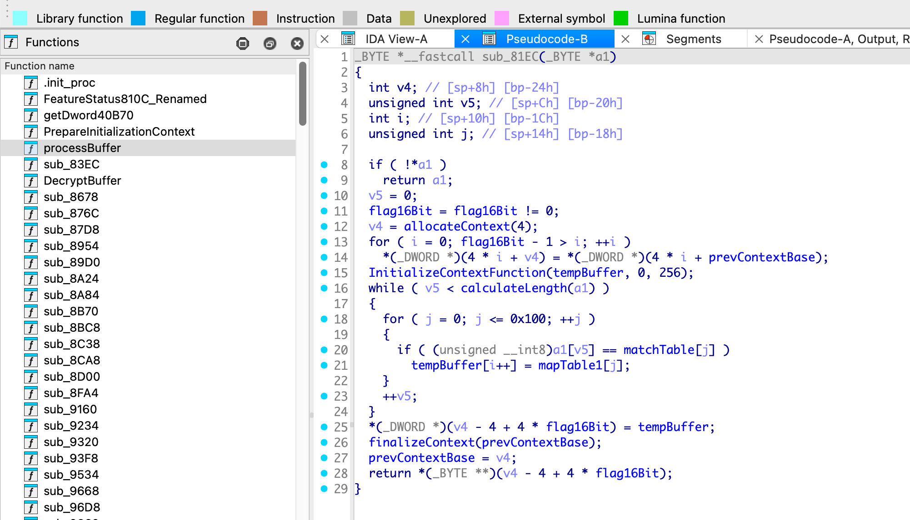
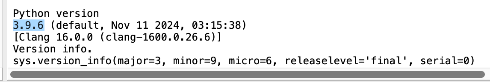
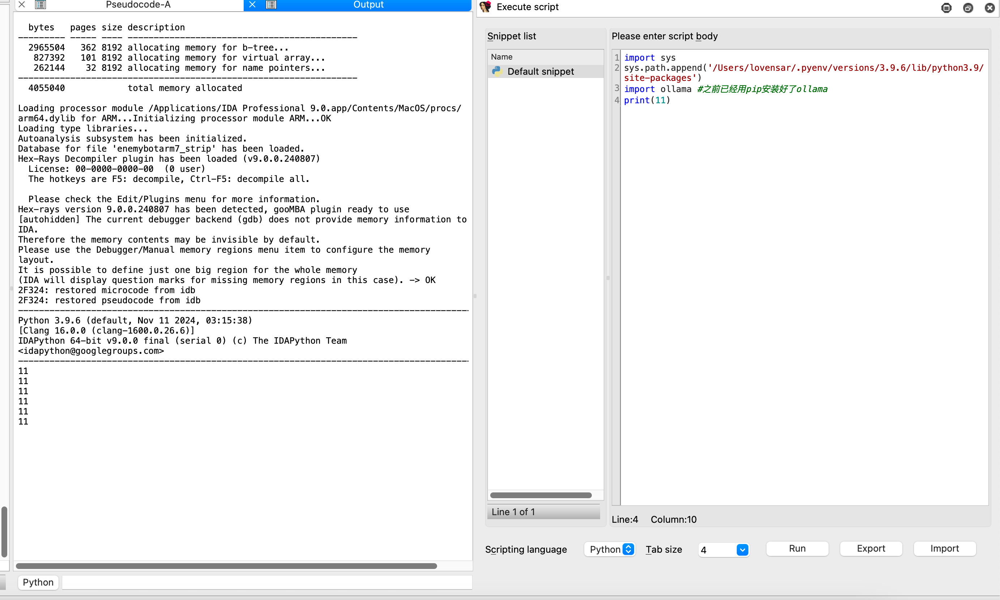

### 测试环境

-   [x] Windows 10/11-IDA 9.0-IDAPython 3.8.10
-   [x] MacOS-IDA 9.0-IDAPython 3.9.6





### Install

#### 本地部署ollma并下载好模型

并在代码以下部分替换成自己想用的模型

```PYTHON
model_name_1 = 'qwen2.5:3b-instruct-q8_0'  # 第一个智能体使用的模型
model_name_2 = 'qwen2.5:3b-instruct-q8_0'  # 第二个智能体使用的模型
```

#### 先检查IDA

```python
import sys
print(sys.version)
```



#### 在idaapi.py脚本开头替换对应python版本的路径

```python
import sys
sys.path.append('/Users/lovensar/.pyenv/versions/3.9.6/lib/python3.9/site-packages')
import ollama #之前已经用pip安装好了ollama
```

可能会与到报错：

报错ModuleNotFoundError: No module named 'pydantic_core._pydantic_core’。

我看路径是3.11.8，然后输入`pyenv global 3.9.6`

#### 替换好之后，重启IDA



然后我们可以开始了。

做了两天时间，目前只做了全局变量和函数名称。

## 调试

现在我的测试环境主要有1.5b、3b、7b、32b和72b的，主要参考了[Qwen2.5](https://ollama.com/library/qwen2.5/tags)和[Qwen2.5-Coder](https://ollama.com/library/qwen2.5-coder/tags)的。

但是具体的任务场景会有所不一样，我的目标是睡一觉起来之后能有一个大致的结果，我借助了GPT-o1(测试时间2024年12月28日)来帮忙评分，大概满分100分的话可以拿一个65分。


当然，这也只是一个不科学的自我尝试罢了。

要稳定的测试的话，针对不同的模型，有一些参数是需要调整一下的：

```PYTHON
# AI Configuration
OLLAMA_HOST = 'http://10.166.33.243:11434'
MODEL_NAME = 'qwen2.5:72b'
TIMEOUT_SECONDS = 60
MAX_RESPONSE_LENGTH = 8192
RENAME_RETRIES = 10
CHUNK_SIZE = 20000
BATCH_SIZE = 10
MAX_TURNS = 2
TEMPERATURE = 0.2
TOP_P = 0.8
MAX_TOKENS = 50000
```

这里面的CHUNK_SIZE是一个比较重要的值，如果过大（超过50000）可能会导致qwen模型陷入自己循环中，表现就是IDA未响应了（Mac和Windows上都是，72b模型和3b模型实测都有这个毛病）。

<u>**CHUNK_SIZE的值我设置了多次查询（如果一个函数伪代码过长的话），72b模型默认是20000，32b是15000，14b/7b/3b默认是10000，1.5b默认是2000。**</u>

MAX_TOKENS和MAX_TURNS是个没用的值，可以忽略。

TEMPERATURE和TOP_P需要更专业的尝试，因此我就先设置比较严谨的值了，但是也尽可能多样性。

后面尝试稳定的话，有时间开发一下对局部变量进行重命名的操作。